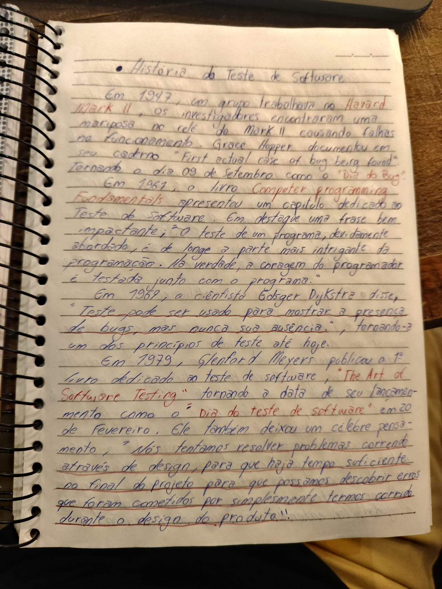
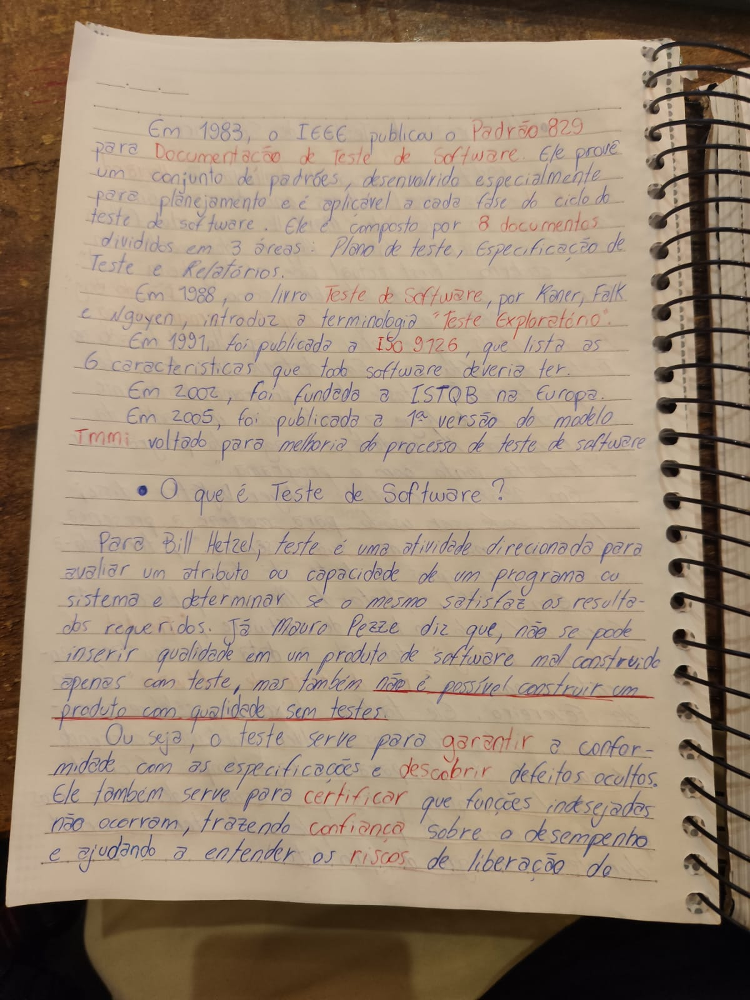

# 02 - História do Teste de Software

Esta pasta documenta meus estudos sobre a evolução histórica do Teste de Software.

Conhecer a história da área é importante para entender como o teste deixou de ser visto apenas como uma atividade final de verificação e passou a fazer parte de todo o processo de desenvolvimento de software.

## Linha do tempo dos principais acontecimentos

| Ano | Acontecimento | Importância |
|---|---|---|
| 1947 | Registro do famoso caso do “bug” no Harvard Mark II | Um dos episódios mais conhecidos da história da computação, associado à popularização do termo bug |
| 1961 | O livro *Computer Programming Fundamentals* apresenta um capítulo dedicado ao teste de software | Mostra que o teste começava a ser tratado como parte importante da programação |
| 1969 | Edsger Dijkstra afirma que testes mostram a presença de bugs, mas nunca sua ausência | Ideia que se tornou um dos princípios fundamentais do teste de software |
| 1979 | Glenford Myers publica *The Art of Software Testing* | Um marco importante para a área de testes |
| 1983 | O IEEE publica o padrão 829 para documentação de teste de software | Contribuiu para a padronização da documentação de testes |
| 1988 | O livro *Teste de Software*, de Kaner, Falk e Nguyen, introduz o termo Teste Exploratório | Reforça a importância da investigação e aprendizado durante os testes |
| 1991 | Publicação da ISO 9126 | Apresenta características de qualidade que um software deveria possuir |
| 2002 | Fundação da ISTQB na Europa | Ajuda a consolidar conhecimentos e certificações na área de teste |
| 2005 | Publicação da primeira versão do modelo TMMi | Modelo voltado à melhoria do processo de teste de software |

## 1947 - O caso do bug no Harvard Mark II

Em 1947, um grupo trabalhava no computador Harvard Mark II quando foi encontrada uma mariposa presa no relé da máquina, causando falhas no funcionamento.

Grace Hopper documentou o caso em seu caderno com a frase:

> “First actual case of bug being found.”

Esse episódio tornou o dia 09 de setembro conhecido como o “Dia do Bug”.

Embora o termo bug já fosse utilizado anteriormente em áreas da engenharia, esse caso se tornou um dos registros mais famosos da história da computação.

## 1961 - Primeiros registros sobre teste de software

Em 1961, o livro *Computer Programming Fundamentals* apresentou um capítulo dedicado ao teste de software.

Uma frase de destaque estudada foi:

> “O teste de um programa, devidamente abordado, é de longe a parte mais intrigante da programação. Na verdade, a coragem do programador é testada junto com o programa.”

Esse pensamento mostra que o teste já começava a ser visto como uma atividade importante, desafiadora e essencial dentro do desenvolvimento.

## 1969 - A contribuição de Edsger Dijkstra

Em 1969, o cientista Edsger Dijkstra afirmou que:

> “Teste pode ser usado para mostrar a presença de bugs, mas nunca sua ausência.”

Essa ideia é extremamente importante para QA, pois mostra que testar não significa provar que um sistema está perfeito. O teste reduz riscos, encontra problemas e aumenta a confiança, mas não garante ausência total de defeitos.

## 1979 - Glenford Myers e The Art of Software Testing

Em 1979, Glenford Myers publicou o livro *The Art of Software Testing*, considerado uma das obras mais importantes da área.

A data de lançamento do livro, 20 de fevereiro, também ficou conhecida como o “Dia do Teste de Software”.

Um pensamento importante deixado por Myers foi:

> “Nós tentamos resolver problemas correndo através do design para que haja tempo suficiente no final do projeto para que possamos descobrir erros que foram cometidos por simplesmente termos corrido durante o design do produto.”

Esse pensamento reforça que muitos defeitos surgem por falhas nas fases iniciais do projeto, especialmente quando requisitos e design são tratados com pressa.

## 1983 - IEEE 829

Em 1983, o IEEE publicou o padrão 829 para documentação de teste de software.

Esse padrão apresentava um conjunto de documentos voltados ao planejamento e organização das atividades de teste.

Segundo minhas anotações, ele era composto por 8 documentos divididos em 3 áreas principais:

- Plano de Teste
- Especificação de Teste
- Relatórios

Esse marco mostra a importância da documentação no processo de teste.

## 1988 - Teste Exploratório

Em 1988, o livro *Teste de Software*, de Kaner, Falk e Nguyen, introduziu a terminologia “Teste Exploratório”.

O teste exploratório valoriza a investigação, a criatividade e o aprendizado do testador durante a execução dos testes.

## 1991 - ISO 9126

Em 1991, foi publicada a ISO 9126, que lista características de qualidade que todo software deveria ter.

Esse marco reforça que qualidade de software não está ligada apenas à ausência de bugs, mas também a características como confiabilidade, usabilidade, eficiência, manutenibilidade, portabilidade e funcionalidade.

## 2002 - Fundação da ISTQB

Em 2002, foi fundada a ISTQB na Europa.

A ISTQB se tornou uma das principais referências internacionais na área de teste de software, contribuindo para a padronização de conceitos, práticas e certificações.

## 2005 - Modelo TMMi

Em 2005, foi publicada a primeira versão do modelo TMMi, voltado para a melhoria do processo de teste de software.

Esse modelo mostra que o teste também pode e deve ser tratado como um processo em evolução contínua.

## Conclusão

Estudar a história do Teste de Software me ajudou a perceber que a área evoluiu muito ao longo do tempo.

O teste deixou de ser apenas uma etapa final de verificação e passou a ser visto como uma atividade estratégica, ligada à qualidade, prevenção de falhas, documentação, melhoria de processos e redução de riscos.

## Evidências de estudo

## Status

Concluído.
