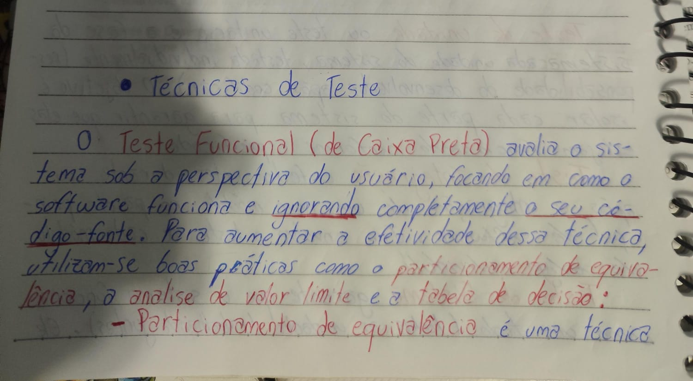
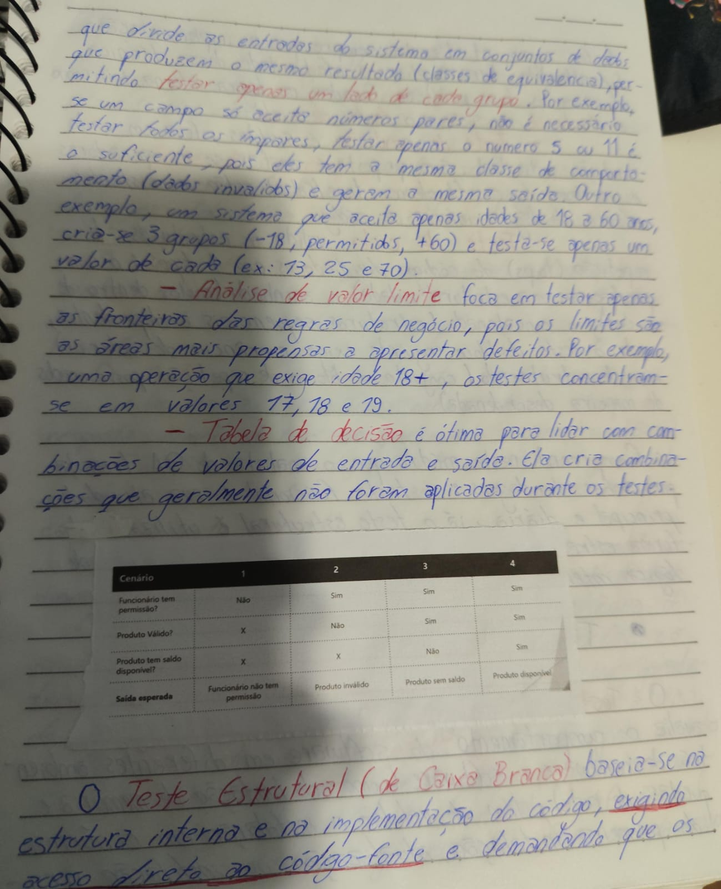

# 09 - Técnicas de Teste

Esta pasta documenta meus estudos sobre técnicas de teste de software, com foco nas abordagens funcional e estrutural.

Nesta etapa, compreendi que existem diferentes formas de testar um sistema. Algumas técnicas observam o comportamento do software pela perspectiva do usuário, enquanto outras analisam a estrutura interna e a lógica do código.

## Objetivo desta etapa

O objetivo deste módulo foi entender as principais técnicas de teste utilizadas para aumentar a efetividade dos testes e melhorar a cobertura dos cenários avaliados.

As técnicas estudadas foram:

- Teste Funcional
- Particionamento de Equivalência
- Análise de Valor Limite
- Tabela de Decisão
- Teste Estrutural
- Teste de Condição
- Teste de Ciclo

---

# Teste Funcional

O teste funcional, também conhecido como teste de caixa preta, avalia o sistema sob a perspectiva do usuário.

Nesse tipo de teste, o foco está em verificar **como o software funciona**, ignorando completamente sua estrutura interna ou código-fonte.

## Objetivo

O objetivo do teste funcional é validar se o sistema atende aos requisitos, regras de negócio e comportamentos esperados.

## Características

- Avalia o comportamento externo do sistema.
- Não exige acesso ao código-fonte.
- Testa entradas e saídas.
- Simula o uso real do usuário.
- É uma das principais atividades do QA no dia a dia.
- Ajuda a validar regras de negócio.

## Exemplo prático

Imagine uma tela de login.

O QA não precisa saber como o código valida o usuário internamente. Ele precisa verificar se, ao informar os dados, o sistema se comporta corretamente.

Exemplos de validações:

- Usuário válido e senha válida devem permitir acesso.
- Usuário inválido deve exibir mensagem de erro.
- Senha incorreta deve bloquear o acesso.
- Campos vazios devem exibir mensagens obrigatórias.

---

# Técnicas de Teste Funcional

Para aumentar a efetividade do teste funcional, algumas boas práticas podem ser utilizadas.

As principais técnicas estudadas foram:

- Particionamento de Equivalência
- Análise de Valor Limite
- Tabela de Decisão

---

# Particionamento de Equivalência

O particionamento de equivalência é uma técnica que divide as entradas do sistema em grupos de dados que produzem o mesmo resultado.

Esses grupos são chamados de classes de equivalência.

A ideia é evitar testar uma grande quantidade de dados semelhantes quando apenas alguns representantes já são suficientes.

## Objetivo

O objetivo do particionamento de equivalência é reduzir a quantidade de testes sem perder a qualidade da validação.

## Como funciona?

Se um campo aceita apenas números pares, não é necessário testar todos os números pares possíveis.

É possível testar apenas alguns representantes dessa classe, pois eles tendem a apresentar o mesmo comportamento esperado.

## Exemplo: campo de idade

Imagine um sistema que aceita apenas usuários com idade entre 18 e 60 anos.

Podemos dividir os dados em três grupos:

| Classe | Valores | Resultado esperado |
|---|---|---|
| Idade abaixo do permitido | Menor que 18 | Inválido |
| Idade permitida | De 18 a 60 | Válido |
| Idade acima do permitido | Maior que 60 | Inválido |

Exemplos de valores para teste:

| Valor testado | Classe | Resultado esperado |
|---|---|---|
| 13 | Menor que 18 | Inválido |
| 25 | Entre 18 e 60 | Válido |
| 70 | Maior que 60 | Inválido |

## Benefício

Essa técnica permite testar menos dados, mas ainda assim cobrir os principais comportamentos esperados do sistema.

---

# Análise de Valor Limite

A análise de valor limite é uma técnica que foca em testar as fronteiras das regras de negócio.

Isso acontece porque os limites costumam ser áreas mais propensas a apresentar defeitos.

## Objetivo

O objetivo da análise de valor limite é verificar se o sistema se comporta corretamente nos valores próximos às bordas permitidas ou não permitidas.

## Exemplo: idade mínima de 18 anos

Imagine uma regra em que o usuário precisa ter pelo menos 18 anos para realizar uma operação.

Em vez de testar valores muito distantes, como 10 ou 50, os testes devem se concentrar nos valores próximos ao limite.

| Valor testado | Situação | Resultado esperado |
|---|---|---|
| 17 | Abaixo do limite | Inválido |
| 18 | No limite permitido | Válido |
| 19 | Acima do limite | Válido |

## Benefício

Essa técnica aumenta a chance de encontrar defeitos em regras de validação, principalmente em condições como:

- Maior que
- Maior ou igual
- Menor que
- Menor ou igual
- Intervalos permitidos
- Quantidades mínimas e máximas

---

# Tabela de Decisão

A tabela de decisão é uma técnica utilizada para lidar com combinações de valores de entrada e saída.

Ela ajuda a organizar diferentes condições e seus respectivos resultados esperados.

## Objetivo

O objetivo da tabela de decisão é validar regras de negócio que possuem múltiplas combinações possíveis.

## Quando utilizar?

Essa técnica é útil quando o comportamento do sistema depende da combinação de diferentes condições.

Exemplos:

- Permissão de usuário.
- Produto válido.
- Produto com saldo disponível.
- Tipo de cliente.
- Forma de pagamento.
- Cupom de desconto.
- Regras de aprovação.

## Exemplo estudado

| Condição | Cenário 1 | Cenário 2 | Cenário 3 | Cenário 4 |
|---|---|---|---|---|
| Funcionário tem permissão? | Não | Sim | Sim | Sim |
| Produto válido? | X | Não | Sim | Sim |
| Produto tem saldo disponível? | X | X | Não | Sim |
| Saída esperada | Funcionário não tem permissão | Produto inválido | Produto sem saldo | Produto disponível |

## Interpretação

Nesse exemplo, a saída esperada muda de acordo com a combinação das condições.

A tabela ajuda o QA a enxergar quais cenários precisam ser testados e evita que combinações importantes sejam esquecidas.

## Benefício

A tabela de decisão é excelente para organizar testes em sistemas com muitas regras condicionais.

---

# Teste Estrutural

O teste estrutural, também conhecido como teste de caixa branca, é baseado na estrutura interna e na implementação do código.

Diferente do teste funcional, essa abordagem exige acesso direto ao código-fonte.

## Objetivo

O objetivo do teste estrutural é validar a lógica interna do software e garantir que os caminhos, condições e estruturas do código funcionem corretamente.

## Características

- Analisa a estrutura interna do código.
- Exige acesso ao código-fonte.
- Verifica lógica, condições e fluxos internos.
- É muito utilizado em automação e testes técnicos.
- Pode ser aplicado por desenvolvedores ou QAs com conhecimento técnico.

## Exemplo prático

Imagine uma função que valida se um usuário pode acessar uma área restrita.

No teste estrutural, a análise não considera apenas o resultado final. Ela verifica também se as condições internas do código estão corretas.

---

# Técnicas de Teste Estrutural

Para ampliar a efetividade do teste estrutural, podem ser utilizadas técnicas focadas na lógica interna do código.

As técnicas estudadas foram:

- Teste de Condição
- Teste de Ciclo

---

# Teste de Condição

O teste de condição é uma técnica simples que foca em cada condição individual presente no código.

Sua proposta é avaliar se operadores e variáveis lógicas, como valores booleanos `true` e `false`, estão consistentes dentro da lógica interna do sistema.

## Objetivo

O objetivo do teste de condição é validar se as decisões internas do código funcionam corretamente.

## Exemplo prático

Imagine uma condição de login:

if (usuarioValido && senhaValida) {
  permitirAcesso();
} else {
  negarAcesso();
}

Neste caso, alguns testes importantes seriam:

| Usuário válido | Senha válida | Resultado esperado |
|---|---|---|
| true | true | Permitir acesso |
| true | false | Negar acesso |
| false | true | Negar acesso |
| false | false | Negar acesso |

## Benefício

Essa técnica ajuda a encontrar problemas em operadores lógicos, condições mal escritas e regras internas incorretas.

---

# Teste de Ciclo

O teste de ciclo valida estruturas de repetição, também chamadas de loops.

Essa técnica divide os ciclos do código em diferentes tipos para analisar se a repetição está funcionando corretamente.

## Objetivo

O objetivo do teste de ciclo é verificar se estruturas de repetição executam a quantidade correta de vezes e se não geram comportamentos inesperados.

## Tipos de ciclos estudados

| Tipo de ciclo | Explicação |
|---|---|
| Simples | Apenas uma estrutura de repetição isolada |
| Aninhado | Ciclos dentro de outros ciclos |
| Concatenado | Estruturas sequenciais e dependentes |
| Desestruturado | Conjunto de blocos de repetição posicionados de maneira desordenada |

## Exemplo prático

Imagine um sistema que percorre uma lista de produtos para calcular o valor total da compra.

O teste de ciclo deve verificar situações como:

- Lista vazia.
- Lista com apenas 1 item.
- Lista com vários itens.
- Lista com muitos itens.
- Interrupção inesperada no loop.
- Repetição além do necessário.

## Benefício

Essa técnica ajuda a encontrar problemas como:

- Loops infinitos.
- Contagem incorreta.
- Repetições desnecessárias.
- Falhas em listas vazias.
- Erros em estruturas aninhadas.

---

# Teste Funcional x Teste Estrutural

| Critério | Teste Funcional | Teste Estrutural |
|---|---|---|
| Também conhecido como | Caixa preta | Caixa branca |
| Foco | Comportamento do sistema | Estrutura interna do código |
| Perspectiva | Usuário e negócio | Código e lógica interna |
| Exige acesso ao código? | Não | Sim |
| Atividade comum para QA manual? | Sim | Menos frequente |
| Uso em automação | Sim | Sim |
| Exemplos de técnicas | Particionamento, valor limite, tabela de decisão | Condição e ciclo |

---

# Minha percepção

Neste módulo, compreendi que o analista de QA transita por diferentes abordagens de teste.

O teste funcional é a atividade principal e mais comum no dia a dia do QA, pois valida o sistema pela perspectiva do usuário e das regras de negócio.

Já o teste estrutural é utilizado de forma mais estratégica, principalmente em contextos técnicos e de automação, para garantir a qualidade da lógica interna do software.

Também entendi que aplicar técnicas como particionamento de equivalência, análise de valor limite e tabela de decisão torna os testes mais inteligentes, evitando esforço desnecessário e aumentando a chance de encontrar defeitos relevantes.

---

# Conclusão

Estudar técnicas de teste me ajudou a perceber que testar não deve ser uma atividade aleatória.

Um bom teste precisa ser planejado, baseado em riscos, regras de negócio, entradas, saídas e comportamento esperado.

As técnicas estudadas ajudam o QA a transformar requisitos em cenários mais objetivos, organizados e eficientes.

---

# Evidências de estudo

---

# Status

Concluído.
