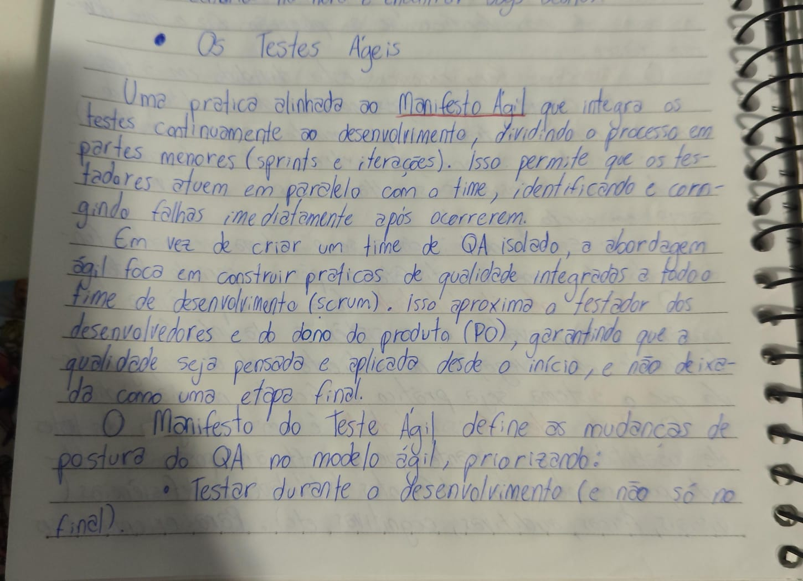
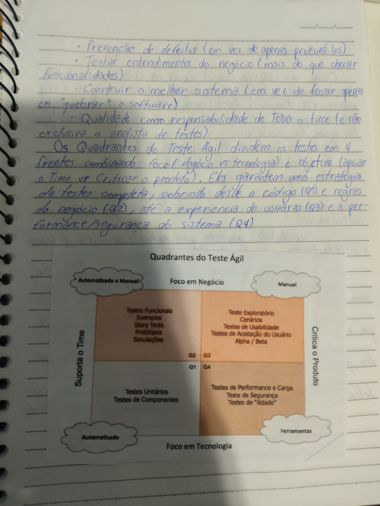

# 11 - Os Testes Ágeis

Esta pasta documenta meus estudos sobre testes ágeis e sua relação com o desenvolvimento de software em metodologias ágeis.

Nesta etapa, compreendi que os testes ágeis são uma prática alinhada ao Manifesto Ágil, integrando a qualidade continuamente ao desenvolvimento e aproximando o QA do time de desenvolvimento, do Product Owner e das decisões de produto.

## Objetivo desta etapa

O objetivo deste módulo foi entender como os testes funcionam dentro de um contexto ágil e como o papel do QA muda quando a qualidade passa a ser responsabilidade de todo o time.

Os principais pontos estudados foram:

- O que são testes ágeis.
- Diferença entre testes tradicionais e testes ágeis.
- Papel do QA em times ágeis.
- Manifesto do Teste Ágil.
- Quadrantes do Teste Ágil.
- Qualidade como responsabilidade compartilhada.

---

# O que são Testes Ágeis?

Os testes ágeis são uma prática alinhada ao Manifesto Ágil que integra os testes continuamente ao processo de desenvolvimento.

Em vez de deixar os testes apenas para o final do projeto, o processo é dividido em partes menores, como sprints e iterações.

Isso permite que os testadores atuem em paralelo com o time, identificando e corrigindo falhas imediatamente após ocorrerem.

## Ideia principal

A ideia dos testes ágeis é que a qualidade seja pensada desde o início do desenvolvimento, e não apenas como uma etapa final antes da entrega.

Nesse modelo, o QA participa mais próximo dos desenvolvedores, do Product Owner e do restante do time.

---

# Testes Ágeis x Modelo Tradicional

No modelo tradicional, muitas vezes o teste acontece apenas após o desenvolvimento da funcionalidade.

Nos testes ágeis, a qualidade é construída durante todo o processo.

| Modelo Tradicional | Testes Ágeis |
|---|---|
| Testes concentrados no final | Testes durante todo o desenvolvimento |
| QA mais isolado | QA integrado ao time |
| Correções mais tardias | Correções mais rápidas |
| Maior risco de retrabalho | Feedback contínuo |
| Qualidade vista como etapa final | Qualidade como parte do processo |

---

# Papel do QA em Times Ágeis

Em um contexto ágil, o QA não atua apenas como alguém que encontra bugs depois que o desenvolvimento terminou.

O QA ajuda o time a pensar em qualidade desde o começo.

## Responsabilidades do QA ágil

- Participar do entendimento dos requisitos.
- Ajudar a identificar riscos.
- Apoiar a definição de critérios de aceite.
- Testar durante o desenvolvimento.
- Colaborar com desenvolvedores.
- Validar comportamentos esperados.
- Comunicar problemas rapidamente.
- Contribuir para a melhoria contínua do produto.
- Apoiar a prevenção de defeitos.

## Aproximação com o time

Em vez de criar um time de QA isolado, a abordagem ágil foca em construir práticas de qualidade integradas a todo o time de desenvolvimento.

Isso aproxima o testador dos desenvolvedores e do dono do produto, garantindo que a qualidade seja pensada, discutida e aplicada desde o início.

---

# Manifesto do Teste Ágil

O Manifesto do Teste Ágil define mudanças de postura do QA dentro do modelo ágil.

Com base nos meus estudos, ele prioriza:

- Testar durante o desenvolvimento, e não apenas no final.
- Prevenir defeitos, em vez de apenas procurá-los.
- Testar o entendimento do negócio, mais do que apenas checar funcionalidades.
- Construir o melhor sistema, em vez de focar apenas em “quebrar” o software.
- Tratar qualidade como responsabilidade de todo o time, e não exclusiva do analista de testes.

## Interpretação

Esses princípios mostram que o QA ágil precisa atuar de forma mais colaborativa, preventiva e estratégica.

O foco não está apenas em encontrar erros, mas em ajudar o time a construir um produto melhor desde o início.

---

# Qualidade como responsabilidade de todo o time

Um dos pontos mais importantes dos testes ágeis é entender que qualidade não pertence apenas ao QA.

A qualidade precisa ser uma responsabilidade compartilhada por todos:

- Desenvolvedores.
- Analistas de teste.
- Product Owner.
- Scrum Master.
- Analistas de negócio.
- Designers.
- Demais pessoas envolvidas no produto.

## O papel do QA nesse contexto

Mesmo que a qualidade seja responsabilidade de todos, o QA continua tendo um papel muito importante.

Ele ajuda o time a pensar em riscos, cenários, validações, critérios de aceite, impactos e possíveis problemas antes que eles cheguem ao usuário.

---

# Quadrantes do Teste Ágil

Os Quadrantes do Teste Ágil dividem os testes em quatro frentes, combinando dois eixos principais:

- Foco: Negócio x Tecnologia.
- Objetivo: Apoiar o time x Criticar o produto.

Eles ajudam a construir uma estratégia de testes mais completa, cobrindo desde o código até regras de negócio, experiência do usuário, performance e segurança.

---

# Q1 - Testes voltados à tecnologia e que apoiam o time

O primeiro quadrante possui foco em tecnologia e tem como objetivo apoiar o time.

Normalmente, envolve testes mais técnicos e automatizados.

## Exemplos

- Testes unitários.
- Testes de componentes.

## Importância

Esses testes ajudam a validar a base técnica do sistema e dão feedback rápido para os desenvolvedores.

---

# Q2 - Testes voltados ao negócio e que apoiam o time

O segundo quadrante possui foco em negócio e também apoia o time.

Ele ajuda a garantir que os requisitos e regras de negócio estejam sendo compreendidos corretamente.

## Exemplos

- Testes funcionais.
- Exemplos.
- Story tests.
- Protótipos.
- Simulações.

## Importância

Esses testes ajudam o time a construir o produto certo, alinhado ao que o negócio realmente precisa.

---

# Q3 - Testes voltados ao negócio e que criticam o produto

O terceiro quadrante possui foco em negócio e tem como objetivo criticar o produto.

A ideia é avaliar o sistema pela perspectiva do usuário e da experiência real de uso.

## Exemplos

- Teste exploratório.
- Cenários.
- Testes de usabilidade.
- Testes de aceitação do usuário.
- Testes Alpha.
- Testes Beta.

## Importância

Esses testes ajudam a descobrir problemas de uso, falhas de entendimento, dificuldades de navegação e comportamentos inesperados.

---

# Q4 - Testes voltados à tecnologia e que criticam o produto

O quarto quadrante possui foco em tecnologia e tem como objetivo criticar o produto.

Ele avalia aspectos técnicos importantes para a qualidade do sistema.

## Exemplos

- Testes de performance.
- Testes de carga.
- Testes de segurança.
- Testes de confiabilidade.

## Importância

Esses testes ajudam a validar se o sistema é seguro, estável, performático e preparado para situações reais ou críticas de uso.

---

# Comparação dos Quadrantes do Teste Ágil

| Quadrante | Foco | Objetivo | Exemplos |
|---|---|---|---|
| Q1 | Tecnologia | Apoiar o time | Testes unitários e testes de componentes |
| Q2 | Negócio | Apoiar o time | Testes funcionais, exemplos, story tests, protótipos e simulações |
| Q3 | Negócio | Criticar o produto | Teste exploratório, cenários, usabilidade, aceitação, alpha e beta |
| Q4 | Tecnologia | Criticar o produto | Performance, carga, segurança e confiabilidade |

---

# Minha percepção

Neste módulo, compreendi que os testes ágeis mudam a forma como o QA participa do desenvolvimento.

Em vez de atuar apenas no final do processo, o QA passa a colaborar desde o início, ajudando o time a entender melhor os requisitos, prevenir defeitos e construir um produto com mais qualidade.

Também entendi que os Quadrantes do Teste Ágil ajudam a enxergar que uma boa estratégia de testes precisa cobrir diferentes perspectivas: tecnologia, negócio, apoio ao time e crítica ao produto.

---

# Conclusão

Estudar testes ágeis me ajudou a perceber que qualidade não deve ser tratada como uma etapa isolada.

Em times ágeis, qualidade é construída continuamente, com colaboração, feedback rápido e participação de todo o time.

O papel do QA continua sendo essencial, mas se torna mais estratégico, pois ajuda a prevenir problemas, validar regras de negócio, apoiar decisões e garantir que o produto entregue valor real ao usuário.

## Evidências de estudo

## Status

Concluído.
